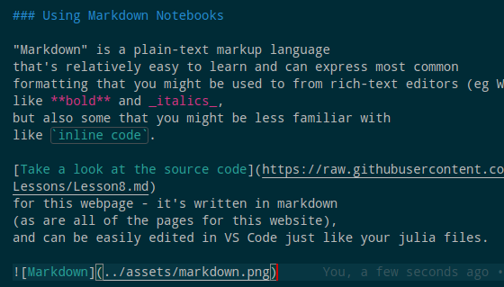
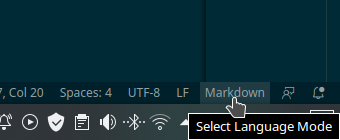

# Lesson 8 - Putting it all together

[](@ref assignment08)
[](@ref assignment08)

**Assignments** - This lesson is complete when students have:

- Read [Chapter 15](https://benlauwens.github.io/ThinkJulia.jl/latest/book.html#chap15)
  and [Chapter 16](https://benlauwens.github.io/ThinkJulia.jl/latest/book.html#chap16)
  of Think Julia.
- Run all code examples from Lesson 8 on their own computers
- Cloned the Assignment 7 repository with github classroom.
- Completed assignment 7 with all tests passing.

_Book correction_: in the section of chapter 16
[on modifiers](https://benlauwens.github.io/ThinkJulia.jl/latest/book.html#modifiers),
the book write a function that is supposed to update a field
of an immutable struct,
so it will throw an error.
You can fix this by making `MyTime` a mutable struct,
or by returning a new instance of `MyTime`.
If you do the later, the function signature
should not have `!` (because it's not mutating the arguments).

(This issue has [already been reported](https://github.com/BenLauwens/ThinkJulia.jl/issues/35) to the book author)

## Development and analysis workflows for scientific computing

Up until now, we have primarily been writing code
that's intended to be re-used.
Code that is well-designed, tested to ensure it functions as intended,
and generic enough to be used in many situations
is an important part of scientific computing.
This kind of code should generally be put into a package.

But this is not the only kind of code.

Often times, we also want to analyze a specific dataset,
perform statistical tests, make plots, etc.
In these cases,
we typically want to include code along with
plain-english explanations, images (eg plots) and other information.

There are several approaches to this,
including [Jupyter notebooks](https://jupyter.org/) (**ju**lia, **py**thon, **R**),
scripts that include explanations in comments
(like your previous assignments)
which can be rendered into more readable forms
with packages like [`Literate.jl`](https://fredrikekre.github.io/Literate.jl/stable/outputformats/)),
or plain-text files that include delineated blocks of code.

### Using Markdown

"Markdown" is a plain-text markup language
that's relatively easy to learn and can express most common
formatting that you might be used to from rich-text editors (eg Word)
like **bold** and _italics_,
but also some that you might be less familiar with
like `inline code`.

[Take a look at the source code](https://raw.githubusercontent.com/wellesley-bisc195/BISC195.jl/trunk/docs/src/Lessons/Lesson8.md)
for this webpage - it's written in markdown
(as are all of the pages for this website),
and can be easily edited in VS Code just like your julia files.



One can also write blocks of code that have syntax highlighting,
the colors that you see in eg. VS Code
that help you see the structure of your code.
Eg. compare the following block without syntax highlighting

```
function a_function(str)
    str = replace(str, " "=>"_")
    println("hi! I'm a String! $str")
end
```

to this one, that has it:

```julia
function a_function(str)
    str = replace(str, " "=>"_")
    println("hi! I'm a String! $str")
end
```

There are many resources for learning markdown online,
including the [official markdown documentation](https://daringfireball.net/projects/markdown/syntax).

### Why use plaintext?

You may be asking yourself,
"Why use plain text when I have things like Word/Google Docs/Pages?"
There are a few reasons including:

1. There are many places where you'd like to have some formatting,
   but rich-text editors are not available.
   In many of these cases (eg github issues, many web forums),
   markdown **is** supported.
2. Documents from software like word often use proprietary encodings,
   requiring anyone trying to read it to have the same software.
   All computers can read plain-text files -
   you can even read plain text files from the command line
   (just try using `head` to see the first 10 lines of a `.docx` file)
3. These proprietary file types often don't play well
   with version control systems like git.

### Using Markdown Notebooks

Using markdown + julia is easy with VS Code.
First, install the `Markdown Julia` extension for VS Code.
(as a reminder, you can click the extensions button in the VS code sidebar
and search for `julia`, then click "install" for `Markdown Julia`).

Now, create a new file, and save it as any file with a `.md` extension,
eg `test_notebook.md`.

!!! tip
    The `.md` extension is typical for markdown-formatted files,
    and gives VS code (and other software) hints about how to handle it
    (eg to provide the correct syntax highlighting),
    but the extension doesn't have any special powers.
    You can tell VS code to treat any file as markdown by changing the language mode.

    

Now write some markdown - eg

````md
# This is a level-1 header

## This is a level-2 header

Some text with **bold** or _italics_ or `inline code`.

```julia
# this is julia code
function foo(arg)
    arg = arg^2
    println("woo! Syntax highlighting!")
    return arg
end
```
````

Notice how code wrapped in 3 "backticks"
(that's the key next to `1` and under `~` on American keyboards)
is formatted like julia code?
You can even run that code as if it were in a `.jl` file
using the `julia` extension (`alt+enter`)!

If you want to see if your formatting looks the way that you expect,
VS code has built-in markdown preview: `ctrl+shift+V`.

!!! tip
    You can use "code fences" in markdown for lots of other languages as well,
    or just have a block of unformatted mono-space text.

    ````
    ```
    # This is unformatted plain text
    "No highlighting"
    function foo()
    end
    ```

    ```julia
    # this is julia formatted
    "With julia highlighting"
    function foo()
    end
    ```
    ````

### Use notebooks for analysis

[Assignment08](@ref assignment08) has 2 parts -
one where you continue to develop your bioinformatics
analysis package from Lesson 7,
and another where you use this code to do some analysis
on SARS-CoV2 genomes.

Even though they both involve writing code,
it probably doesn't make sense to use the same workflow for both.
For one, there's no need to wrap the analysis code into a package.

But just like you should keep a lab notebook to record the results of experiments,
it's important to keep track of the code you write 
and the results that you get.
To do this, we can use markdown files.